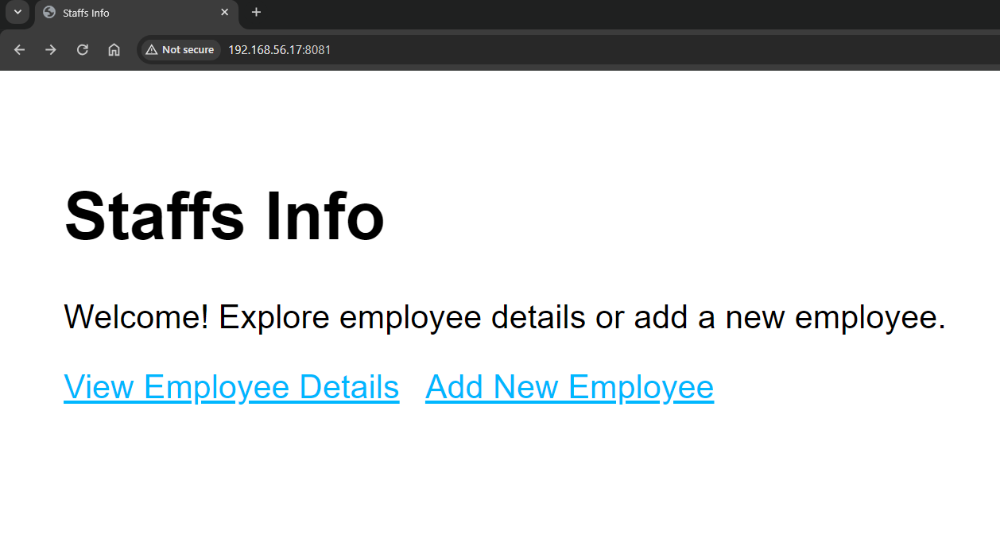
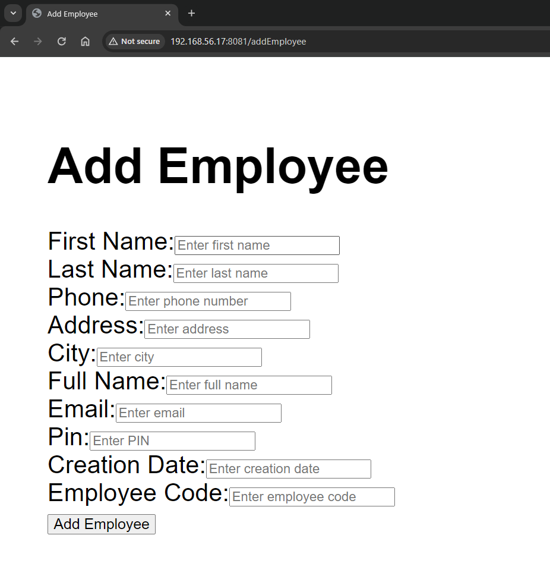
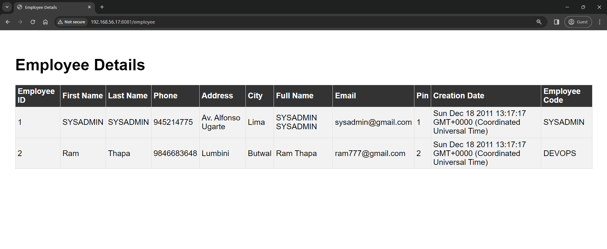

#STAFFS-INFO-APP
In this sample, we will look at the functionality provided by Docker for defining and running multi-container Docker applications.

We are going to use 'MySQL' like our specialized database and 'Node.js' as our platform for creating highly performant web applications.

#ScreenShots

    

    

    

    

    

### IMAGE BUILD
1. `./img-build.sh`

### RUN THE PROJECT
2. `./run-container.sh`

### INSPECT YOUR MYSQL CONTAINER(to see your database)
1. docker ps
2. docker exec -it YOUR_MYSQL_CONTAINER_ID mysql -u root -p
3. put mysql password
4. enter 
5. use employee;
6. show tables;
7. describe EMPLOYEE;

### TO ALTER THE USER INFORMATION OF MYSQL
1. ALTER USER 'root'@'localhost' IDENTIFIED WITH mysql_native_password BY 'mysql-password';
