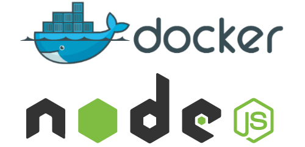

#STAFFS-INFO-APP
1. This is a DevOps Workflow project for demonstrating following aspects of SDLC with Agile Method:
   - Code Management
   - Version Control System Git.
   - CI/CD Pipeline with Jenkins for:
      - testing,
      - building,
      - image pushing,
      - stagging,
      - deploying and
   - monitoring
2. We are going to use 'MySQL' like specialized database and 'Node.js' as our platform for creating highly performant web applications.
3. Building: Used Docker compose for building Docker Image.
4. Testing: For Analysis and Testing We used Sonarqube.
5. Registry: For Image Registry we have used Dockerhub but Harbor registry can also be used.
6. Stagging and Deployment: We used AWS EKS Cluster (AWS compliance Kubernetes Cluster) which is to be already setup.
7. Future Enhancement: For future enhancement, We will add following in this project:
     - Terraform: For AWS EKS Cluster Setup with IaaC (Infrastructure as a code) we'll use Terraform.
     - Ansible: For Configuration Management we'll use Ansible. Code is already in this project but there need to be error fixed.
     - Prometheus and Graphana: For monitoring purpose.
     - Nexus Artifactory: For storage of artifactory we'll use Nexus.

#ScreenShots

    

    

    

    

    

